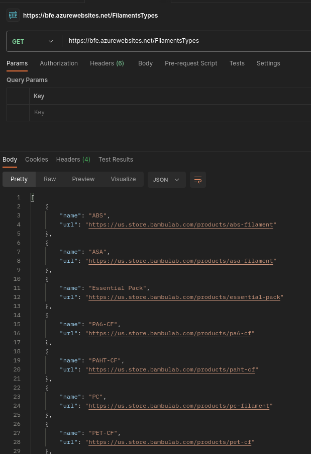
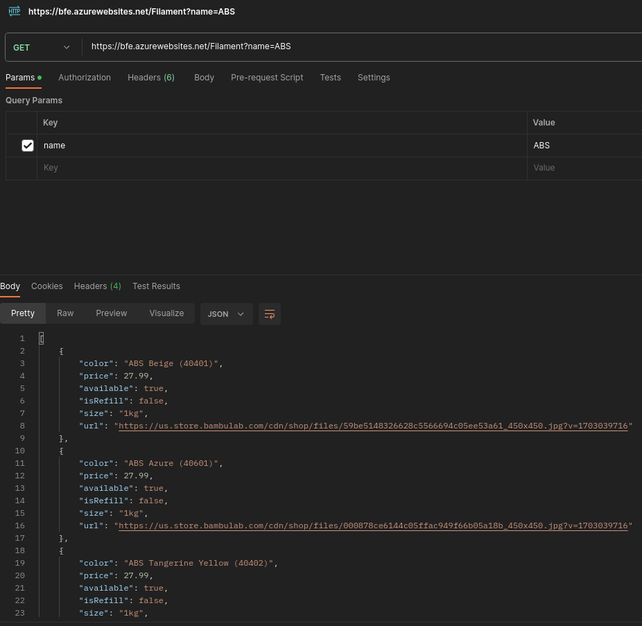

# BFE
Me aburri y necesito algo para extraer los json de los filamentos de BambuLabs. Sitio web https://bfe.azurewebsites.net/swagger/index.html

Ejemplo de https://bfe.azurewebsites.net/FilamentsTypes

Ejemplo de consultar ABS https://bfe.azurewebsites.net/Filament?name=ABS
